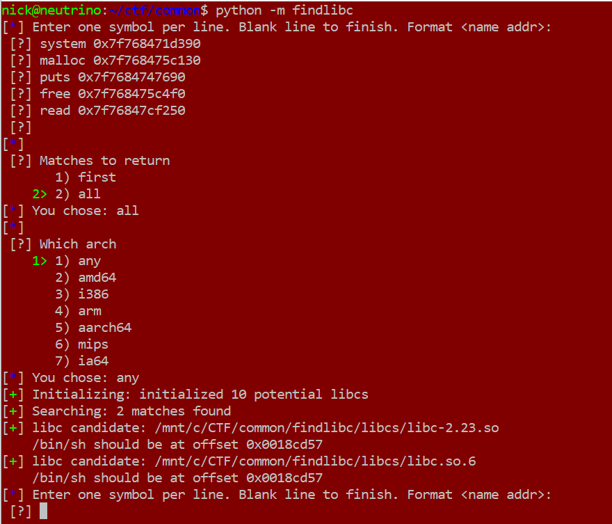

# findlibc

This is a small tool I wrote to help identify a version of `libc` given some leaked addresses and their symbol names.

This comes in handy when tackling CTF challenges where `libc` isn't provided, but we're able to leak some addresses. Using these leaked addresses, we can make an educated guess as to the `libc` version, potentially easing the burden of exploitation.

# Methodology

Given a set of 2 or more leaked symbols, it will iterate over a collection of `libc` files and find one whose symbol table contains a set of offsets for the provided symbol names which matches the relative offsets of the provided address leaks. That was a mouthful, these [comments](__init__.py#L65-L92) are a bit more thoughtful.

# Usage - Interactive

The tool can be used interactively, like so: `python -m findlibc`.



# Usage - Script

The tool can also be used in your scripts.

```python
import findlibc

funcs = {
	"read":   0x7f76847cf250,
	"puts":   0x7f7684747690,
	"system": 0x7f768471d390,
	"free":   0x7f768475c4f0,
	"malloc": 0x7f768475c130,
}

results = findlibc.find(funcs, arch='any', many=True)
```

The first argument should be a dictionary of symbols. The following option arguments are first an architecture (default `'any'`) and second whether you want all macthes (`True`, returns a list of tuples) or the first match (`False`, default, returns a tuple).

The returned tuple(s) are `(libc, filename)` where `libc` is a `pwntools.ELF` and `filename` is a string.

# Dependencies

Hard dependency on `pwntools`. This also implies a dependency on `python2.7`, as that is what pwntools supports.

If you want to get it running on any other version using a custom or unofficial `pwntools` fork, GLHF.

# Libc Files

I've included some random `libc` files. These are what I had laying around in my CTF working directory.

You can get many more from [here](https://github.com/libcdb/ubuntu), but these will slow it down a lot. The code is written to handle this dataset, however, and will filter out extraneous libs. `pwntools` does choke on some parts of that set, and might need massaging.
